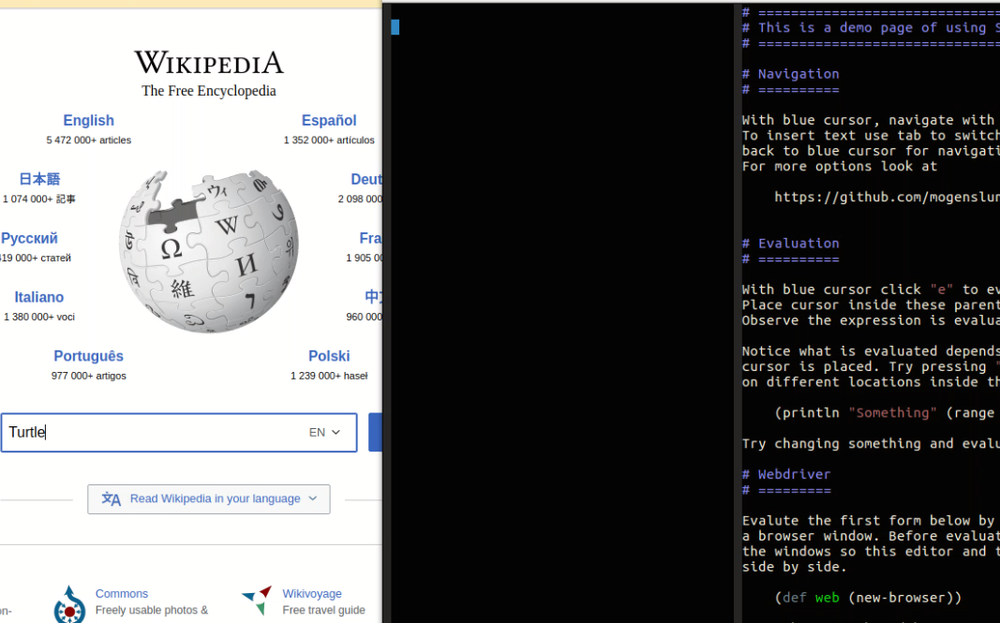

# Liquid Webdriver Test

This is a sample project, both to show how to create browser tests using Selenium Webdriver and how to use Liquid to design tests and evaluate forms to make test development easier.

Just clone this project and run

    lein liq

(requires Leiningen)

Follow the instructions on the first page.

It has only been tested on Linux, so adjustments might need to be made to make it work on Windows.

To run on mac you might need to replace the chromedriver with the Mac one from here:

    https://chromedriver.storage.googleapis.com/index.html?path=2.32/

# Video
Watch the video below to see it in action.

## License

Copyright © 2017 Mogens Brødsgaard Lund

Distributed under the Eclipse Public License either version 1.0 or (at
your option) any later version.